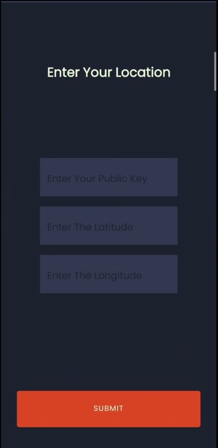
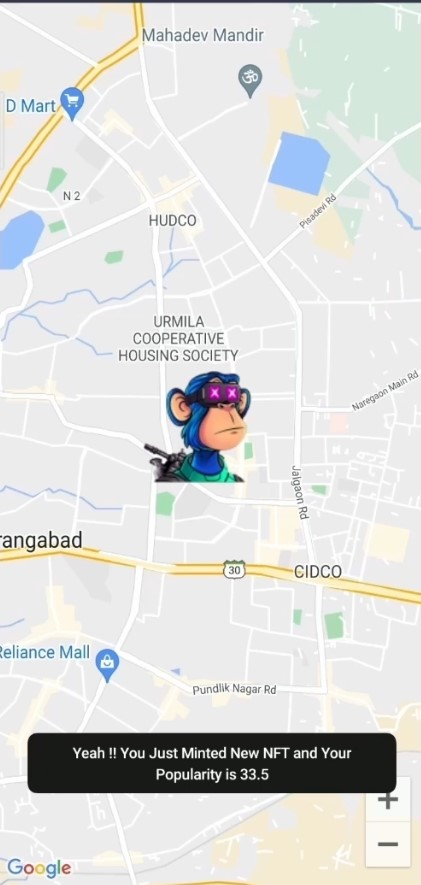
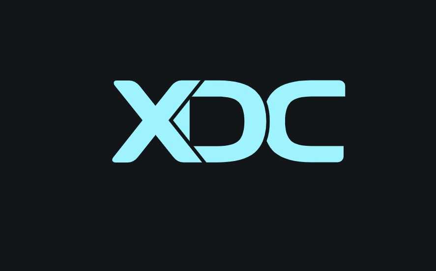
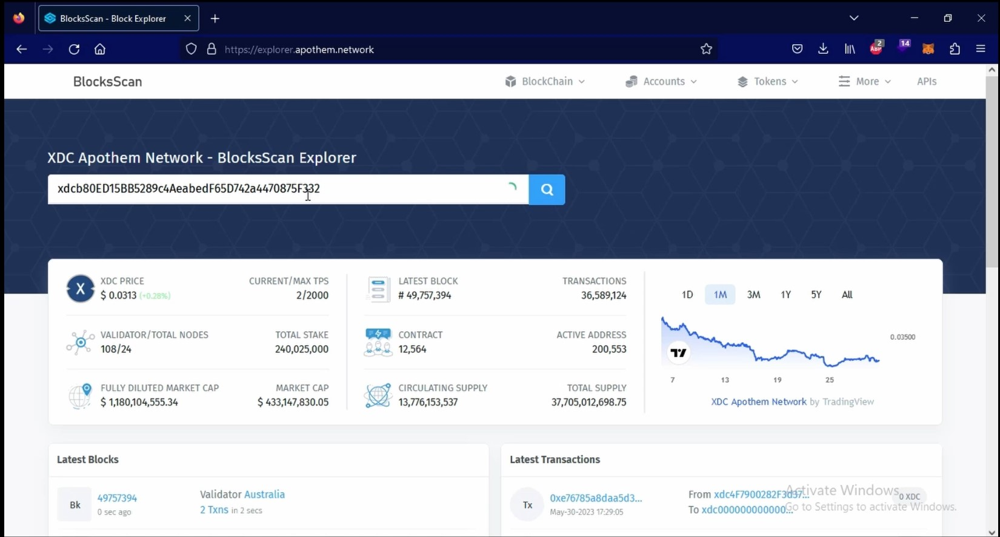

## Project Name :- EXPLORE THE WORLD VENTURE OUTSIDE TO CAPTURE GEO-TAGGED NFTs
### Team name :- MapX
#### Hackathon Track :- XDC NETWORK

##### Team Members
- Abhijeet Singh (Leader) back-end, front-end, android-development
- Yogesh Kute front-end, ui-ux, blockchain

#### Project Description
Businesses often find it difficult to market themselves to drive foot traffic. According to the US Bureau of labour statistics ,traditional businesses find it hard to market themselves to consumers

• About 20% of small businesses fail by the end of their first year

• By the end of their fifth year, 50% go under ;

•  And by the tenth year, that number rises to 80%

Traditional marketing methods have limitations such as high cost and being time-consuming. These problems can be solved

 • The outbreak of the COVID-19 pandemic has devastated businesses worldwide. These businesses include restaurants, theme parks as well as shopping malls. Prolonged lockdown and safe-distancing measures drastically decreased the foot traffic and revenue of these businesses, forcingt hem to shut down or pivot.

#### Summary
A next-gen geo-tagged playground where players meet opportunities offered with a timeless technology. Map-based gameplay with capabilities to engage players and provide market visibility to enterprise.

  • The next generation of web building blocks are here — foster relationships between you and your customer .Tokenize your business offerings into a format that is hard to resist for your target group.

  • Pokemon Go has proven that it can flock people into places to "catch them all". Team Encrypt is aiming to offer businesses the exact same effect. Build communities by gathering people together.

  • Encrpyt mission is to be an NFT platform with real-life utilities. It seeks to encourage exploration and adventure

  • Collectable geo-tagged NFTs will be available around the neighbourhood, which players can redeem.

a) These NFTs can be in the form of vouchers from retail businesses such as restaurants, stores and theme parks, collectables such as limited edition digital pets as well as digital art.

b) This serves as a marketing tool for businesses to drive foot traffic while promoting health and wellness.
Opportunity

Target audience

Crypto Projects, Firms and Communities.

Our main audience is crypto projects, firms and communities. They can choose to mint NFTs that Crypto projects, are tied to physical locations, allowing players to collect them at the location. These NFTs can have future economic or sentimental utilities. This serves firms and as a marketing tool to help engage their respective communities, at the same time providing an communities element of gamification to their project.

Our audience can also choose to mint NFTs for special events at certain locations. An example will be the Kaiju Kings community meetup in Singapore. Holders of the Kaiju Kings NFT were invited to a party with free food and drinks. Thus, these event NFTs can provide additional incentives for crypto communities to gather at a location. We foresee the increase of crypto adoption in the future, thus the emergence of communities big or small. Retail businesses

Our secondary audience is retail businesses. They can utilize the MapX platform as a Retail marketing tool to drive foot traffic. They do this by issuing NFT vouchers. This can be done by Businesses setting up a redemption point in or near their stores. All they have to do is to shake their phone with the Encrypt app on tablets or smartphones and a token will be marked as used. This reduces the operating costs associated with needing to have a spare tablet or smartphone.Consumers can then spend the NFT effectively “burning” it. On top of NFT vouchers, businesses can also issue NFT collectables as well as art pieces. Compared to traditional marketing tools, Encrypt provides several advantages to businesses.

Guarantee foot traffic/high conversion rate.

Since consumers have already made the effort to redeem the NFT vouchers physically, they are Guaranteed foot highly likely to spend those vouchers on the spot. A scenario is that hungry players would traffic/high scan the MapX app for possible food deals, and redeem the NFT voucher that would bring the highest utility/suit the player’s taste preferences.conversion rate. They would then use those vouchers on the spot to purchase from businesses.

This guarantees foot traffic to the store Minimally, players would be exposed to the underlying brand and its products. Optimally, players will be converted to customers through sales. Having physically been to the store also reduces consumer resistance. This can be in the form of difficulty navigating to the store or a mismatch between product expectation and reality. Low Cost and Effective Marketing.

MapX promotes businesses for free through the browse function. This is where users can search the map for possible NFTs to redeem. In MapX pricing model, businesses are charged for minting new NFTs. Since voucher redemption is highly correlated to conversion, businesses essentially are only charged for successful conversions. This was sociated with traditional marketing. Time-efficient

Providing an existing pool of users who are ready to venture out and collect NFTs. Thus providing businesses with potential consumers to be converted

Business

Artists

Artists can use MapX to tokenize both physical as value well as digital artworks. They can then give these artworks away or auction them off through the platform . MapX offers an intuitive user interface

Players

Players are users who collect NFTs using the MapX app

• Transferable vouchers. Traditional E- vouchers are often restricted to the person intended. Oftentimes, these vouchers are left unspent due to neglect,resulting in wastage.• Non-perishability. Traditional physical vouchers are susceptible to damage , making them a hassle to store. NFT vouchers are stored digitally in the player’s wallet,making them non-perishable

• Transparent. Using the XDCand Filecoin blockchain, NFTs minted can be traced and observed by everyone XDC BLOCKCHAIN

Why XDC : XDC Network is an enterprise-grade, open-source blockchain protocol. An EVM-compatible chain with enforceable smart contracts, it is uniquely suited to revolutionize, decentralize, and liquify the trade finance industry through the tokenization of real world assets and financial instruments.

Enterprise : The XDC Network is a groundbreaking blockchain with impressive speed, scalability, low fees, and military-grade security. Using XDC Network, businesses can improve their record keeping, exchange data and transfer assets more efficiently and more securely.

Trade Finance : The XDC Network sets a benchmark for digitizing trade finance by enabling the tokenization of diverse trade finance instruments and assets.

Developers & Creators : The XDC Network is an enterprise-grade, open-source and EVM-compatible Layer 1 blockchain. Geared to accommodate any EVM tool set, developers can carry their skills from other chains onto the XDC Network.

#### URLs
https://youtu.be/4cOQlu_haEY

#### Next Steps
We Need support and contacts with vendors ,businesses and restaurants for testing and release of  our application 

## How to Install 
1) Download the apk file [MAPX]([https://drive.google.com/file/d/1oZIDC3V8pG8D8A7y5_JGBiM-BtyT7iOl/view?usp=sharing](https://drive.google.com/file/d/1k66i3-EyOTOAWWFi0NIDwZe8rHCyzgCr/view?usp=sharing)) [https://drive.google.com/file/d/1oZIDC3V8pG8D8A7y5_JGBiM-BtyT7iOl/view?usp=sharing](https://drive.google.com/file/d/1k66i3-EyOTOAWWFi0NIDwZe8rHCyzgCr/view?usp=sharing) and install in your android phone 

2) Catch all the NFTs

## Deployed smart contract 

xdcb80ED15BB5289c4AeabedF65D742a4470875F332
