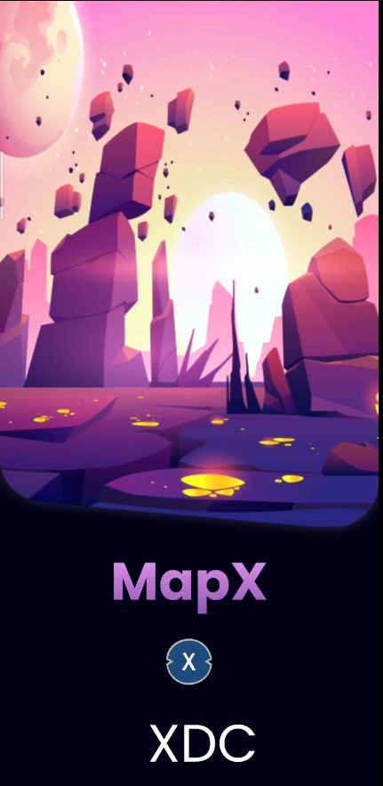

## Project Name :- EXPLORE THE WORLD VENTURE OUTSIDE TO CAPTURE GEO-TAGGED NFTs
### Team name :- MapX
#### Hackathon Track :- XDC NETWORK

##### Team Members
- Abhijeet Singh (Leader) back-end, front-end, android-development
- Yogesh Kute front-end, ui-ux, blockchain

#### Project Description
Businesses often find it difficult to market themselves to drive foot traffic. According to the US Bureau of labour statistics ,traditional businesses find it hard to market themselves to consumers

• About 20% of small businesses fail by the end of their first year

• By the end of their fifth year, 50% go under ;

•  And by the tenth year, that number rises to 80%

Traditional marketing methods have limitations such as high cost and being time-consuming. These problems can be solved

 • The outbreak of the COVID-19 pandemic has devastated businesses worldwide. These businesses include restaurants, theme parks as well as shopping malls. Prolonged lockdown and safe-distancing measures drastically decreased the foot traffic and revenue of these businesses, forcingt hem to shut down or pivot.

#### Summary
A next-gen geo-tagged playground where players meet opportunities offered with a timeless technology. Map-based gameplay with capabilities to engage players and provide market visibility to enterprise.

  • The next generation of web building blocks are here — foster relationships between you and your customer .Tokenize your business offerings into a format that is hard to resist for your target group.

  • Pokemon Go has proven that it can flock people into places to "catch them all". Team Encrypt is aiming to offer businesses the exact same effect. Build communities by gathering people together.

  • Encrpyt mission is to be an NFT platform with real-life utilities. It seeks to encourage exploration and adventure

  • Collectable geo-tagged NFTs will be available around the neighbourhood, which players can redeem.

a) These NFTs can be in the form of vouchers from retail businesses such as restaurants, stores and theme parks, collectables such as limited edition digital pets as well as digital art.

b) This serves as a marketing tool for businesses to drive foot traffic while promoting health and wellness.

Why XDC : XDC Network is an enterprise-grade, open-source blockchain protocol. An EVM-compatible chain with enforceable smart contracts, it is uniquely suited to revolutionize, decentralize, and liquify the trade finance industry through the tokenization of real world assets and financial instruments.

Enterprise : The XDC Network is a groundbreaking blockchain with impressive speed, scalability, low fees, and military-grade security. Using XDC Network, businesses can improve their record keeping, exchange data and transfer assets more efficiently and more securely.

Trade Finance : The XDC Network sets a benchmark for digitizing trade finance by enabling the tokenization of diverse trade finance instruments and assets.

Developers & Creators : The XDC Network is an enterprise-grade, open-source and EVM-compatible Layer 1 blockchain. Geared to accommodate any EVM tool set, developers can carry their skills from other chains onto the XDC Network.

#### URLs
https://youtu.be/4cOQlu_haEY

#### Next Steps
We Need support and contacts with vendors ,businesses and restaurants for testing and release of  our application 

## How to Install 
1) Download the apk file [MAPX]([https://drive.google.com/file/d/1oZIDC3V8pG8D8A7y5_JGBiM-BtyT7iOl/view?usp=sharing](https://drive.google.com/file/d/1k66i3-EyOTOAWWFi0NIDwZe8rHCyzgCr/view?usp=sharing)) [https://drive.google.com/file/d/1oZIDC3V8pG8D8A7y5_JGBiM-BtyT7iOl/view?usp=sharing](https://drive.google.com/file/d/1k66i3-EyOTOAWWFi0NIDwZe8rHCyzgCr/view?usp=sharing) and install in your android phone 

2) Catch all the NFTs

## Deployed smart contract 

xdcb80ED15BB5289c4AeabedF65D742a4470875F332
